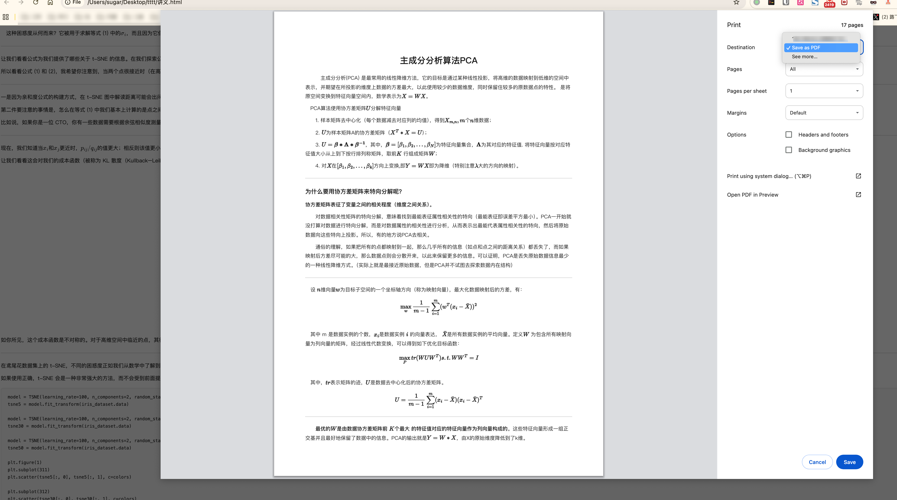

# md2pdf — Markdown 转 PDF 工具

将 Markdown 文件转换为 PDF，支持中文、图片、LaTeX 数学公式和代码块。

## 功能

- **数学公式** — 通过 MathJax 3 渲染，支持行内 `$...$` 和独立 `$$...$$` 公式
- **图片** — 支持相对路径引用的 PNG/JPG/JPEG 图片
- **中文排版** — 使用苹方等系统字体
- **代码高亮** — 保留代码块格式

## 依赖

- Python 3
- `markdown` 库（`pip install markdown`）
- Claude Code（提供 Playwright MCP 工具）
- 网络连接（加载 MathJax CDN）

## 使用方法

### 第一步：生成 HTML

在包含 `.md` 文件的目录下运行：

```bash
python3 md2pdf.py
```

脚本会自动扫描当前目录下所有 `.md` 文件，为每个文件生成对应的 `.html`。

### 第二步：将 HTML 转为 PDF（两种方式任选其一）

#### 方式一：通过 Playwright 自动生成（Claude Code 环境）

启动本地 HTTP 服务（Playwright 不支持 `file://` 协议）：

```bash
python3 -m http.server 8899
```

在 Claude Code 对话中执行以下操作：

1. **导航到 HTML 页面**

   让 Claude 打开浏览器：
   ```
   帮我用 Playwright 打开 http://localhost:8899/讲义.html
   ```

2. **等待渲染完成**

   MathJax 需要几秒钟渲染数学公式，等待约 10 秒。

3. **导出 PDF**

   让 Claude 执行 Playwright 代码生成 PDF：
   ```
   帮我把当前页面导出为 PDF
   ```

   Claude 会执行类似以下代码：
   ```javascript
   await page.pdf({
     path: '讲义.pdf',
     format: 'A4',
     margin: { top: '20mm', bottom: '20mm', left: '18mm', right: '18mm' },
     printBackground: true,
   });
   ```

#### 方式二：浏览器打印保存为 PDF（手动操作）

1. 启动本地 HTTP 服务：
   ```bash
   python3 -m http.server 8899
   ```

2. 在浏览器中打开生成的 HTML 文件：
   ```
   http://localhost:8899/讲义.html
   ```

3. 等待页面完全加载（数学公式渲染完毕），然后使用浏览器的打印功能：

   - **macOS**：`Command + P`
   - **Windows / Linux**：`Ctrl + P`



4. 在打印对话框中：
   - 目标打印机选择 **"另存为 PDF"**（或 "Save as PDF"）
   - 根据需要调整边距、纸张大小等选项
   - 勾选 **"背景图形"** 以保留代码块等背景色
   - 点击保存

### 一句话完成（方式一）

直接告诉 Claude Code：

```
把当前目录下的 md 文件转换成 pdf，注意图片和数学公式
```

Claude 会自动完成所有步骤。

## 文件结构

```
项目目录/
├── md2pdf.py          # 转换脚本
├── README.md          # 本文件
├── 讲义.md            # 源 Markdown 文件
├── img/               # 图片目录
│   ├── PCA.png
│   ├── jiangwei2.png
│   └── ...
└── 讲义.pdf           # 生成的 PDF
```

## 注意事项

- MathJax 从 CDN 加载，需要网络连接
- 图片使用相对路径，确保 `img/` 目录与 `.md` 文件在同一目录下
- 导出 PDF 前确保页面已完全加载（特别是公式和图片）

