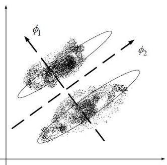
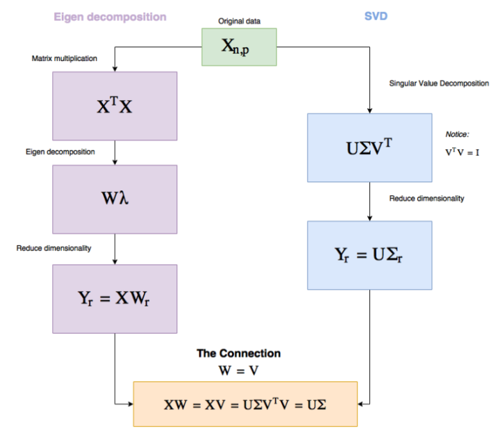
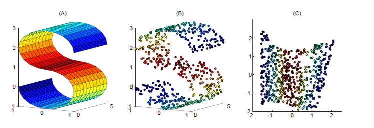
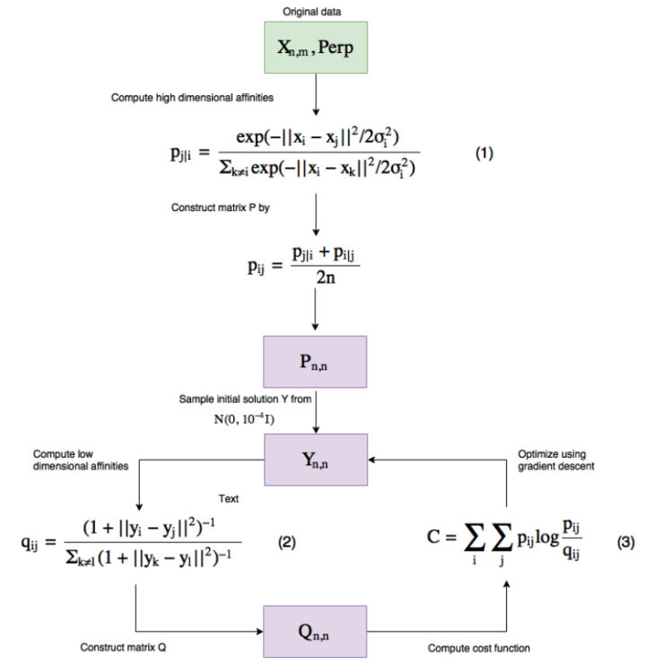
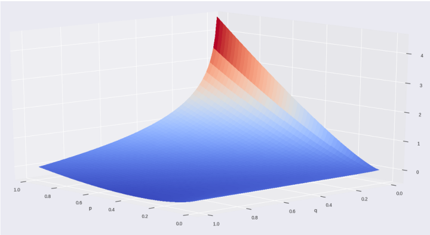

# <center>主成分分析算法PCA</center>

&emsp;&emsp;&emsp;主成分分析(PCA) 是最常用的线性降维方法，它的目标是通过某种线性投影，将高维的数据映射到低维的空间中表示，并期望在所投影的维度上数据的方差最大，以此使用较少的数据维度，同时保留住较多的原数据点的特性。 是将原空间变换到特征向量空间内，数学表示为$X = WX$。

&emsp;PCA算法使用协方差矩阵$U​$分解特征向量

&emsp;&emsp;1. 样本矩阵去中心化（每个数据减去对应列的均值），得到$X_{m,n}, m​$个$n​$维数据；

&emsp;&emsp;2. $U$为样本矩阵A的协方差矩阵（$X^T*X=U$）；

&emsp;&emsp;3. $U=\boldsymbol{\beta*\Lambda*\beta^{-1}}​$，其中，$\boldsymbol{\beta}=[\beta_1,\beta_2,\ldots,\beta_N]​$为特征向量集合，$\boldsymbol{\Lambda}​$为其对应的特征值. 将特征向量按对应特征值大小从上到下按行排列称矩阵，取前$K​$ 行组成矩阵$W​$；

&emsp;&emsp;4. 对$X$在$[\beta_1,\beta_2,\ldots,\beta_k]$方向上变换,即$Y=WX$即为降维（特别注意$\lambda$大的方向的映射）。

***

### 为什么要用协方差矩阵来特向分解呢？ 　　

**协方差矩阵表征了变量之间的相关程度（维度之间关系）。** 　　

&emsp;&emsp;对数据相关性矩阵的特向分解，意味着找到最能表征属性相关性的特向（最能表征即误差平方最小）。PCA一开始就没打算对数据进行特向分解，而是对数据属性的相关性进行分析，从而表示出最能代表属性相关性的特向，然后将原始数据向这些特向上投影。所以，有的地方说PCA去相关。 

&emsp;&emsp;通俗的理解，如果把所有的点都映射到一起，那么几乎所有的信息（如点和点之间的距离关系）都丢失了，而如果映射后方差尽可能的大，那么数据点则会分散开来，以此来保留更多的信息。可以证明，PCA是丢失原始数据信息最少的一种线性降维方式。（实际上就是最接近原始数据，但是PCA并不试图去探索数据内在结构）

***

&emsp;设 $n$维向量$w$为目标子空间的一个坐标轴方向（称为映射向量），最大化数据映射后的方差，有：
$$
\max_{w} \frac{1}{m-1}\sum_{i=1}^{m}(w^T(x_i-\bar{X}))^2
$$
&emsp;其中 m 是数据实例的个数，$x_i $是数据实例 $i$ 的向量表达， $\bar{X}$是所有数据实例的平均向量。定义$W$ 为包含所有映射向量为列向量的矩阵，经过线性代数变换，可以得到如下优化目标函数：
$$
\max_{P} tr(WUW^T)\\
s.t. WW^T=I
$$
&emsp;其中，$tr$表示矩阵的迹，$U$是数据去中心化后的协方差矩阵。
$$
U=\frac{1}{m-1}\sum_{i=1}^{m}(x_i-\bar{X})(x_i-\bar{X})^T
$$
***

&emsp;&emsp;**最优的$W$是由数据协方差矩阵前 $K $个最大 的特征值对应的特征向量作为列向量构成的**。这些特征向量形成一组正交基并且最好地保留了数据中的信息。PCA的输出就是$Y = W*X$，由X的原始维度降低到了k维。

　PCA追求的是在降维之后能够最大化保持数据的内在信息，并通过衡量在投影方向上的数据方差的大小来衡量该方向的重要性。但是这样投影以后对数据的区分作用并不大，反而可能使得数据点揉杂在一起无法区分。这也是PCA存在的最大一个问题，这导致使用PCA在很多情况下的分类效果并不好。具体可以看下图所示，若使用PCA将数据点投影至一维空间上时，PCA会选择2轴，这使得原本很容易区分的两簇点被揉杂在一起变得无法区分；而这时若选择1轴将会得到很好的区分结果。

 

***

### 零均值化

当对训练集进行 PCA  降维时，也需要对验证集、测试集执行同样的降维。而**对验证集、测试集执行零均值化操作时，均值必须从训练集计算而来**，不能使用验证集或者测试集的中心向量。

原因：

我们的训练集是可观测到的数据；测试集为**不可观测**的数据，所以不会知道其均值；而验证集在大部分情况下是在处理完数据后再从训练集中分离出来，一般不会单独处理。如果真的是单独处理了，不能独自求均值的原因是和测试集一样。

另外，我们也需要**保证一致性**，我们拿训练集训练出来的模型用来预测测试集的前提假设就是两者是独立同分布的，如果不能保证一致性的话，会出现**方差平移**的问题。

***

### 与 SVD 的对比

这是两个不同的数学定义。我们先给结论：**特征值和特征向量是针对方阵**才有的，而**对任意形状的矩阵都可以做奇异值分解**。

**PCA**：方阵的特征值分解，对于一个方阵A，总可以写成：$A=Q\Lambda Q^{-1}$  。

其中，$Q $是这个矩阵 $A$ 的特征向量组成的矩阵，$\Lambda$ 是一个对角矩阵，每一个对角线元素就是一个特征值，里面的特征值是由小排列的，这些特征值所对应的特征向量就是描述这个矩阵变化方向（从主要的变化到次要的变化排列）。也就是说矩阵$ A $的信息可以由其特征值和特征向量表示。

***

**SVD**：矩阵的奇异值分解其实就是对于矩阵 A 的协方差矩阵 $A^TA$ 和$AA^T$ 做特征值分解推导出来的：
$$
A_{m,n}=U_{m,m}\Lambda_{m,n}V_{n,n}^T\approx U_{m,k}\Lambda_{k,k}V_{k,n}^T
$$
其中：$U, V$ 都是正交矩阵，有 $U^TU=I_m$, $V^TV=I_n$, 。这里的约等于是因为 $\Lambda$中有 $n$ 个奇异值，但是由于排在后面的很多接近 0，所以我们可以仅保留比较大的$ k$ 个奇异值。
$$
A^TA=(U\Lambda V^T)^TU\Lambda V^T=V\Lambda^TU^TU\Lambda V^T=V\Lambda^2V^T\\
AA^T=U\Lambda V^T(U\Lambda V^T)^T=U\Lambda V^TV\Lambda^TU^T=U\Lambda^2U^T
$$
所以，$V , U$ 两个矩阵分别是$A^TA$  和$AA^T$ 的特征向量，中间的矩阵对角线的元素是$A^TA$  和$AA^T$  和  的特征值。我们也很容易看出$ A$ 的奇异值和$A^TA$   的特征值之间的关系。

PCA 需要对协方差矩阵$C=\frac{1}{m}XX^T$  。进行特征值分解； SVD 也是对$A^TA$   进行特征值分解。如果取 $A=\frac{X^T}{\sqrt{m}}$ 则两者基本等价。所以 PCA 问题可以转换成 SVD 求解。

***

而实际上 Sklearn 的 PCA 就是用 SVD 进行求解的，原因有以下几点：

1. 当样本维度很高时，协方差矩阵计算太慢；
2. 方阵特征值分解计算效率不高；
3. SVD 出了特征值分解这种求解方式外，还有更高效更准球的迭代求解方式，避免了$A^TA$  的计算；
4. PCA 与 SVD 的右奇异向量的压缩效果相同。

**PCA优缺点：**

　　优点：1.最小误差 2.提取了主要信息

　　缺点：PCA将所有的样本（特征向量集合）作为一个整体对待，去寻找一个均方误差最小意义下的最优线性映射投影，而忽略了类别属性，而它所忽略的投影方向有可能刚好包含了重要的可分性信息。

***

### 算法案例

PCA的工作流程：

 

***

**代码（PCA）** 

用 TensorFlow 写这个代码是很简单的，我们要编码的是一个带有 fit 方法和我们将提供维度的 reduce 方法的类。设 self.X 包含数据且 self.dtype=tf.float32，那么 fit 方法看起来就是这样：

```python
def fit(self):
    self.graph = tf.Graph()
    with self.graph.as_default():
        self.X = tf.placeholder(self.dtype, shape=self.data.shape)

        # Perform SVD
        singular_values, u, _ = tf.svd(self.X)

        # Create sigma matrix
        sigma = tf.diag(singular_values)

    with tf.Session(graph=self.graph) as session:
        self.u, self.singular_values, self.sigma = session.run([u, singular_values, sigma],
       feed_dict={self.X: self.data})
```

所以 fit 的目标是创建我们后面要用到的 Σ 和 U。

我们将从 tf.svd 行开始，这一行给了我们奇异值和矩阵 U 和 V。

然后 tf.diag 是 TensorFlow 的将一个 1D 向量转换成一个对角矩阵的方法，在我们的例子中会得到 Σ。

在 fit 调用结束后，我们将得到奇异值、Σ 和 U。

***

现在让我们实现 reduce。

```python 
def reduce(self, n_dimensions=None, keep_info=None):
    if keep_info:
        # Normalize singular values
        normalized_singular_values = self.singular_values / sum(self.singular_values)

        # Create the aggregated ladder of kept information per dimension
        ladder = np.cumsum(normalized_singular_values)

        # Get the first index which is above the given information threshold
        index = next(idx for idx, value in enumerate(ladder) if value >= keep_info) + 1
        n_dimensions = index

    with self.graph.as_default():
        # Cut out the relevant part from sigma
        sigma = tf.slice(self.sigma, [0, 0], [self.data.shape[1], n_dimensions])

        # PCA
        pca = tf.matmul(self.u, sigma)

    with tf.Session(graph=self.graph) as session:
        return session.run(pca, feed_dict={self.X: self.data})
```

reduce 既有 keep_info，也有 n_dimensions（我没有实现输入检查看是否只提供了其中一个）。如果我们提供 n_dimensions，它就会降维到那个数；但如果我们提供 keep_info（应该是 0 到 1 之间的一个浮点数），就说明了我们将从原来的数据中保存多少信息（假如是 0.9，就保存 90% 的数据）。

在第一个 if 中，我们规范化并检查了需要多少了奇异值，基本上能从 keep_info 得知 n_dimensions。

在这个图中，我们只需要从 Σ (sigma) 矩阵切下我们所需量的数据，然后执行矩阵乘法。

***

现在让我们在鸢尾花数据集上试一试，这是一个 (150, 4) 的数据集，包含了三种鸢尾花。

```python 
from sklearn import datasets
import matplotlib.pyplot as plt
import seaborn as sns

tf_pca = TF_PCA(iris_dataset.data, iris_dataset.target)
tf_pca.fit()
pca = tf_pca.reduce(keep_info=0.9)  # Results in 2 dimensions

color_mapping = {0: sns.xkcd_rgb['bright purple'], 1: sns.xkcd_rgb['lime'], 2: sns.xkcd_rgb['ochre']}
colors = list(map(lambda x: color_mapping[x], tf_pca.target))

plt.scatter(pca[:, 0], pca[:, 1], c=colors)
```

***

### 线性判别分析（LDA）

LDA是一种监督学习的降维技术，也就是说它的数据集的每个样本是有类别输出的。这点和PCA不同。PCA是不考虑样本类别输出的无监督降维技术。LDA的思想可以用一句话概括，就是“**投影后类内方差最小，类间方差最大**”。

 我们要将数据在低维度上进行投影，投影后希望**每一种类别数据的投影点尽可能的接近，而不同类别的数据的类别中心之间的距离尽可能的大**。LDA是为了使得降维后的数据点尽可能地容易被区分。

***

假设原始数据表示为$X$，（$m*n$矩阵，$m$是维度，$n$是样本的数量）既然是线性的，那么就是希望找到映射向量$A$， 使得 $A^TX$后的数据点能够保持以下两种性质：

　　　　1、同类的数据点尽可能的接近（within class）

　　　　2、不同类的数据点尽可能的分开（between class）

　　所以呢还是上次PCA用的这张图，如果图中两堆点是两类的话，那么我们就希望他们能够投影到轴1去（PCA结果为轴2），这样在一维空间中也是很容易区分的。

 

***

### 瑞利商（Rayleigh quotient）与广义瑞利商（genralized Rayleigh quotient） 

我们首先来看看瑞利商的定义。瑞利商是指这样的函数$R(A,x)$:
$$
R(A,x)=\frac{x^HAx}{x^Hx}
$$
其中$x$为非零向量，而$A$为$n×n$的Hermitan矩阵。所谓的Hermitan矩阵就是满足共轭转置矩阵和自己相等的矩阵，即$A^H=A$。如果我们的矩阵A是实矩阵，则满足$A^T=A$的矩阵即为Hermitan矩阵。　　　　

瑞利商$R(A,x)$有一个非常重要的性质，即它的最大值等于矩阵$A$的最小的特征值，也就是满足:
$$
\lambda_{min}\leq\frac{x^HAx}{x^Hx}\leq \lambda_{max}
$$
***

当向量$x$是标准正交基时，即满足$x^Hx=1$时，瑞利商退化为：$R(A,x)=x^HAx$，这个形式在谱聚类和PCA中都有出现。　　　

广义瑞利商是指这样的函数$R(A,B,x)$: 
$$
R(A,x)=\frac{x^HAx}{x^HBx}
$$
其中$x$为非零向量，而$A,B$为$n×n$的Hermitan矩阵。$B$为正定矩阵。它的最大值和最小值是什么呢？其实我们只要通过将其通过标准化就可以转化为瑞利商的格式。我们令$x=B^{−1/2}x′$，则分母转化为：
$$
x^HBx=x′H(B^{−1/2})HBB^{−1/2}x′=x′HB^{−1/2}BB^{−1/2}x′=x′^Hx′
$$
而分子转化为：$x^HAx=x′^HB^{−1/2}AB^{−1/2}x′$

***

此时我们的$R(A,B,x)$转化为$R(A,B,x′)$:
$$
R(A,B,x′)=\frac{x′^HB^{−1/2}AB^{−1/2}x′}{x′^Hx′}
$$
利用前面的瑞利商的性质，我们可以很快的知道，$R(A,B,x′)$的最大值为矩阵$B^{−1/2}AB^{−1/2}$

的最大特征值，或者说矩阵$B^{−1}A$的最大特征值，而最小值为矩阵$B^{−1}A$的最小特征值。

***

### 二类LDA原理　　　　

现在我们回到LDA的原理上，我们在第一节说讲到了LDA希望投影后希望同一种类别数据的投影点尽可能的接近，而不同类别的数据的类别中心之间的距离尽可能的大，但是这只是一个感官的度量。现在我们首先从比较简单的二类LDA入手，严谨的分析LDA的原理。　　　　

假设我们的数据集$D=\left\{(x_1,y_1),(x_2,y_2),...,((x_m,y_m))\right\}$,其中任意样本$x_i$为$n$维向量$y_i\in\left\{0,1\right\}$。我们定义$N_j(j=0,1)$为第$j$类样本的个数，$X_j(j=0,1)$为第$j$类样本的集合，而$\mu_j(j=0,1)$为第$j$类样本的均值向量，定义$\Sigma_j(j=0,1)$为第$j$类样本的协方差矩阵（严格说是缺少分母部分的协方差阵）。　　　

$\mu_j$的表达式为：
$$
μ_j=\frac{1}{N_j}\sum _{x\in X_j}x(j=0,1)
$$
$\Sigma_j$的表达式为：
$$
\Sigma_j=\sum_{x\in X_j}(x−\mu_j)(x−\mu_j)^T(j=0,1)
$$
***

由于是两类数据，因此我们只需要将数据投影到一条直线上即可。假设我们的投影直线是向量$w$,则对任意一个样本本$x_i$,它在直线$w$的投影为$w^Tx_i$,对于我们的两个类别的中心点$\mu_0,\mu1$,在直线$w$的投影为$w^T\mu_0$

和$w^T\mu_1$。由于LDA需要让不同类别的数据的类别中心之间的距离尽可能的大，也就是我们要最大化$||w^T\mu_0−w^T\mu_1||_2^2$,同时我们希望同一种类别数据的投影点尽可能的接近，也就是要同类样本投影点的协方差$w^T\Sigma _0w$和$w^T\Sigma _1w$尽可能的小，即最小化$w^T\Sigma _0w+w^T\Sigma _1w$。综上所述，我们的优化目标为：
$$
\underbrace{ argmax } _wJ(w)=\frac{||w^T\mu_0−w^T\mu_1||_2^2}{w^T\Sigma_0w+w^T\Sigma_1w}=\frac{w^T(\mu_0−\mu_1)(\mu_0−\mu_1)^Tw}{w^T(\Sigma_0+\Sigma_1)w}
$$
***

我们一般定义类内散度矩阵$S_w$为：
$$
S_w=\Sigma_0+\Sigma_1=\sum_{x\in X_0}(x−\mu_0)(x−\mu_0)^T+\sum_{x\in X_1}(x−\mu_1)(x−\mu_1)^T
$$
同时定义类间散度矩阵$S_b$为：
$$
S_b=(\mu_0−\mu_1)(\mu_0−\mu_1)^TS_b=(\mu_0−\mu_1)(\mu_0−\mu_1)^T
$$
这样我们的优化目标重写为：
$$
\underbrace{ argmax } _wJ(w)=\frac{w^TS_bw}{w^TS_ww}
$$

***

$$
\underbrace{ argmax } _wJ(w)=\frac{w^TS_bw}{w^TS_ww}
$$

上式就是我们的广义瑞利商。这就简单了，利用我们第二节讲到的广义瑞利商的性质，我们知道我们的$J(w′)$最大值为矩阵$S_w^{\frac{−1}{2}} S_b S_w^{\frac{−1}{2}}$的最大特征值，而对应的$w′$为$S_w^{\frac{−1}{2} }S_b S^{\frac{−1}{2}}_w$的最大特征值对应的特征向量，而$S_w^{−1} S_b$的特征值和$S_w^{\frac{−1}{2}} S_b S_w^{\frac{−1}{2}}$的特征值相同,$S_w^{−1} S_b$的特征向量$w$和$S_w^{\frac{−1}{2} }S_b S^{\frac{−1}{2}}_w$的特征向量$w′$满足$w=S_w^{\frac{−1}{2}} w′$的关系。

注意到对于二类的时候，在$S_bw$的方向恒平行于$\mu_0−\mu_1$，不妨令$S_bw=\lambda(\mu_0−\mu_1)$，将其带入：$(S^{−1}_wS_b)w=\lambda w$，可以得到$w=S^{−1}_w(\mu_0−\mu_1)$， 也就是说我们只要求出原始二类样本的均值和方差就可以确定最佳的投影方向$w$了。

***

### 多类LDA原理　　　

假设数据集为$D=\left\{(x_1,y_1),(x_2,y_2),...,(x_m,y_m)\right\}$,其中任意样本$x_i$为$n$维向量，$y_i\in\left\{C_1,C_2,...,C_k\right\}$。我们定义$N_j(j=1,2...k)$为第$j$类样本的个数，$X_j(j=1,2...k)$为第$j$类样本的集合，而$\mu_j(j=1,2...k)$为第$j$类样本的均值向量，定义$\Sigma_j(j=1,2...k)$为第$j$类样本的协方差矩阵。在二类LDA里面定义的公式可以很容易的类推到多类LDA。　　　　

***

由于我们是多类向低维投影，则此时投影到的低维空间就不是一条直线，而是一个超平面了。假设我们投影到的低维空间的维度为$d$，对应的基向量为$(w_1,w_2,...w_d)$，基向量组成的矩阵为$W$, 它是一个$n×d$

的矩阵.此时我们的优化目标应该可以变成为:


$$
\frac{W^TS_bW}{W^TS_wW}
$$
其中$S_b=\sum_{j=1}^kN_j(\mu_j−\mu)(\mu_j−\mu)^T$,$\mu$为所有样本均值向量。$S_w=\sum_{j=1}^kS_{wj}=\sum_{j=1}^k\sum_{x \in X_j}(x−\mu_j)(x−\mu_j)^T$。但是有一个问题，就是$W^TS_bW$和$W^TS_wW$都是矩阵，不是标量，无法作为一个标量函数来优化！也就是说，我们无法直接用二类LDA的优化方法，怎么办呢？一般来说，我们可以用其他的一些替代优化目标来实现。　　　　

***

常见的一个LDA多类优化目标函数定义为：
$$
\underbrace{ argmax } _WJ(W)=\frac{\prod_{diag}W^TS_bW}{\prod_{diag}W^TS_wW}
$$
其中$\prod_{diag}A$为$A$的主对角线元素的乘积，$W$为$n×d$的矩阵。 　　　　

$J(W)$的优化过程可以转化为：
$$
J(W)=\frac{\prod_{i=1}^dw_i^TS_bw_i}{\prod_{i=1}^dw_i^TS_ww_i}
$$
***

仔细观察上式最右边，为广义瑞利商。最大值是矩阵$S^{−1}_wS_b$的最大特征值,最大的$d$个值的乘积就是矩阵$S^{−1}wS_b$的最大的d个特征值的乘积,此时对应的矩阵$W$为这最大的d个特征值对应的特征向量张成的矩阵。　　　　

由于$W$是一个利用了样本的类别得到的投影矩阵，因此它的降维到的维度$d$最大值为$k-1$。为什么最大维度不是类别数$k$呢？因为$S_b$中每个$\mu_j−\mu$的秩为1，因此协方差矩阵相加后最大的秩为$k$(矩阵的秩小于等于各个相加矩阵的秩的和)，但是由于如果我们知道前$k-1$个$\mu_j$后，最后一个$\mu_k$可以由前$k-1$个$\mu_j$

线性表示，因此$S_b$的秩最大为$k-1$，即特征向量最多有$k-1$个。

***

### LDA算法流程　　　

输入：数据集$D=\left\{(x_1,y_1),(x_2,y_2),...,(x_m,y_m)\right\}$,,其中任意样本$x_i$为n维向量，$y_i\in\left\{C_1,C_2,...,C_k\right\}$，降维到的维度$d$。　　　　

输出：降维后的样本集$D′$　　　　

1. 计算类内散度矩阵$S_w$
2. 计算类间散度矩阵$S_b$
3. 计算矩阵$S^{−1}_wS_b$
4. 计算$S^{−1}_wS_b$的最大的$d$个特征值和对应的$d$个特征向量$(w_1,w_2,...w_d)$,得到投影矩阵$W$
5. 对样本集中的每一个样本特征$x_i$，转化为新的样本$z_i=W^Tx_i$

6. 得到输出样本集$D′=\left\{(z_1,y_1),(z_2,y_2),...,((z_m,y_m))\right\}$

***

 以上就是使用LDA进行降维的算法流程。实际上LDA除了可以用于降维以外，还可以用于分类。一个常见的LDA分类基本思想是假设各个类别的样本数据符合高斯分布，这样利用LDA进行投影后，可以利用极大似然估计计算各个类别投影数据的均值和方差，进而得到该类别高斯分布的概率密度函数。当一个新的样本到来后，我们可以将它投影，然后将投影后的样本特征分别带入各个类别的高斯分布概率密度函数，计算它属于这个类别的概率，最大的概率对应的类别即为预测类别。

***

### LDA与PCA的区别：

LDA用于降维，和PCA有很多相同，也有很多不同的地方，因此值得好好的比较一下两者的降维异同点。
首先我们看看相同点：
1）两者均可以对数据进行降维。

2）两者在降维时均使用了矩阵特征分解的思想。

3）两者都假设数据符合高斯分布。

我们接着看看不同点：

1）LDA是有监督的降维方法，而PCA是无监督的降维方法

2）LDA降维最多降到类别数k-1的维数，而PCA没有这个限制。

3）LDA除了可以用于降维，还可以用于分类。

4）LDA选择分类性能最好的投影方向，而PCA选择样本点投影具有最大方差的方向。

***

算法代码：

```python
import numpy as np
from sklearn.datasets import load_iris
import matplotlib.pyplot as plt
from sklearn.discriminant_analysis import LinearDiscriminantAnalysis


def LDA_dimensionality(X, y, k):
    '''
    X为数据集，y为label，k为目标维数，多类别
    '''
    label_ = list(set(y))

    X_classify = {}

    for label in label_:
        X1 = np.array([X[i] for i in range(len(X)) if y[i] == label])
        X_classify[label] = X1

    mju = np.mean(X, axis=0)
    mju_classify = {}

    for label in label_:
        mju1 = np.mean(X_classify[label], axis=0)
        mju_classify[label] = mju1

    #St = np.dot((X - mju).T, X - mju)

    Sw = np.zeros((len(mju), len(mju)))  # 计算类内散度矩阵
    for i in label_:
        Sw += np.dot((X_classify[i] - mju_classify[i]).T,
                     X_classify[i] - mju_classify[i])

    # Sb=St-Sw

    Sb = np.zeros((len(mju), len(mju)))  # 计算类内散度矩阵
    for i in label_:
        Sb += len(X_classify[i]) * np.dot((mju_classify[i] - mju).reshape(
            (len(mju), 1)), (mju_classify[i] - mju).reshape((1, len(mju))))

    eig_vals, eig_vecs = np.linalg.eig(
        np.linalg.inv(Sw).dot(Sb))  # 计算Sw-1*Sb的特征值和特征矩阵

    sorted_indices = np.argsort(eig_vals)
    topk_eig_vecs = eig_vecs[:, sorted_indices[:-k - 1:-1]]  # 提取前k个特征向量
    return topk_eig_vecs


if '__main__' == __name__:

    iris = load_iris()
    X = iris.data
    y = iris.target

    W = LDA_dimensionality(X, y, 2)
    X_new = np.dot((X), W)
    plt.figure(1)
    plt.scatter(X_new[:, 0], X_new[:, 1], marker='o', c=y)

    # 与sklearn中的LDA函数对比
    lda = LinearDiscriminantAnalysis(n_components=2)
    lda.fit(X, y)
    X_new = lda.transform(X)
    print(X_new)
    plt.figure(2)
    plt.scatter(X_new[:, 0], X_new[:, 1], marker='o', c=y)

    plt.show()

```

***

##  流形学习

　　流形学习的主要算法有：ISOMap（等距映射）、LE（拉普拉斯特征映射）、LLE（局部线性嵌入）。 **流形：**直线或者曲线是一维流形，平面或者曲面是二维流形，更高维之后是多维流形。一个流形好比是d维的空间，是一个m维空间（m>n）被扭曲之后的空间。流形并不是一个“形状”，而是一个“**空间**” 　　**流形学习的假设：数据采样于某一流形上。**

------

###  ISOMap（等距特征映射）

　　ISOMap是一种非迭代的全局优化算法。ISOMap对MDS（Multidimensional Scaling-多维尺度分析）进行改造，用测地线距离（曲线距离）作为空间中两点距离，原来是用欧氏距离，从而将位于某维流形上的数据映射到一个欧氏空间上。 

　　ISOMap将数据点连接起来构成一个邻接Graph来离散地近似原来流形，而测地距离则相应地通过Graph上的最短路径来近似了。 比如：我们将球体曲面映射到二维平面上。

***

　　1）ISOMap适用的流形：适合于内部平坦的低维流形，不适合于学习有较大内在曲率的流形。 

　　2）近邻数的选择：近邻数应足够大以便能够减少在路径长度和真实测地距离之间的不同，但要小到能够预防“短路”现象。 

　　3）所构造图的连通性：要求所构造的图示连通的，否则有两种处理办法，一种是放宽临界点选择的限制，另一种是对于每一连通部分分别使用ISOMap算法，得到不同部分的降维结果。 

　　数据到底是否分布于一个流形上？这是个暂时难以回答的问题。 

　　**MDS是一种降维方法，它在降维时使得降维之后的两点间的欧氏距离尽量保持不变**（用欧氏距离矩阵来表示高维向量的两两之间的相似度，寻找同样数量的映射维度的向量，使得映射维度下两两间距离约等于原高维下两两间距离，变为了优化问题）。

------

###  LLE（局部线性嵌入）

　　前提假设：数据没有形成一个封闭的超曲面，局部数据点是线性的。 　　**LLE（Locally Linear Embedding-局部线性嵌入）是一种非线性降维算法，它能够使降维后的数据较好地保持原有 流形结构 。LLE用局部线性反映全局的非线性的算法，并能够使降维的数据保持原有数据的拓扑结构。**（在流形上使用局部线性，并用有限局部样本的互相线性表示，得到几何特性的构造权重矩阵，在低维下找到满足高维时样本间构造权重的样本集）LLE 是一种无监督学习的方法。 

***

　　使用LLE将三维数据（b）映射到二维（c）之后，映射后的数据仍能保持原有的数据流形（红色的点互相接近，蓝色的也互相接近），说明LLE有效地保持了数据原有的流行结构。

 

但是LLE在有些情况下也并不适用，如果数据分布在整个封闭的球面上，LLE则不能将它映射到二维空间，且不能保持原有的数据流形。那么我们在处理数据中，首先假设数据不是分布在闭合的球面或者椭球面上。LLE算法认为每一个数据点都可以由其近邻点的线性加权组合构造得到。

***

### 算法的主要步骤分为三步：

1. 寻找每个样本点的k个近邻点；

2. 由每个样本点的近邻点计算出该样本点的局部重建权值矩阵；

3. 由该样本点的局部重建权值矩阵和其近邻点计算出该样本点的输出值。

***

### LLE步骤如下： 

1.计算或者寻找数据点$x_i$的临近数据点。 

　假设数据局部为平面，故可以用线性组合表示$x_i$，其误差为：
$$
E(w)=\sum_{i}^{N} m_i=\sum_{i}^{N}||x_i-\sum_{j}^{K}K_jx_{ij}||_2=\sum_{i}^{N}||x_i-\sum_{j}^{K}w_{ij}x_{ij}||_2； \sum_{j}^{K} K_j=\sum_{j}^{K}w_{ij}=1
$$
 其中$x_{ij}$表示第个点的第个近邻，其权值表示线性重构时的贡献比例 。覆盖所有临近点权值之和为1.找到每个样本点的K个最近邻点。 

***

2.计算构造权重并重构数据 

通过约束计算，使得不在该样本点的个最近邻点中的构造权重都为0. 重构权重使得重构的数据点与临近点间的旋转、缩放、平移特性保持不变，即几何特性不依赖于特定的参考框架。

***

 3.由重构样本向低维映射。（求低维嵌入） 

设$z$是低维空间，找到同样数量的低维映射样本，使得：
$$
\min E(w)=\sum_{i}^{N}|m_i|=\sum_{i}^{N}||\phi(x_i)-\sum_{j}^{K}K_jx_{ij}||_2=\sum_{i}^{N}||\phi(x_i)-\sum_{j}^{K}w_{ij}\phi(x_{ij})||_2
$$
结果显示，对上式求解等价于对矩阵$(I-W)^(I-W)$ 进行特征值分解，丢弃与最小特征值相关的特征向量，选取那些与下一个（更低的）特征值相关的特征向量，由此带来低维空间的输出。

***

解释：

LLE算法最后一步是将所有样本点映射到低维空间中。映射条件满足：

$\min E(w)=\sum_{i}^{N}||y_i-\sum_{j}^{K}w_{ij}y_{ij}||_2$

其中是的K个临近点，切满足条件：

K-邻域的选择:

在参数设置中，K只作为一个经验参数，并没有提出很好的办法，通常算法规定K必须大于样本输出的维数。

***

流形学习优缺点： 　　

优点：1）假设流形的存在，部分解决了高维数据分布的问题。 　　

缺点：1）假设流形的存在，不能总是适合数据特点。

***

算法代码

```python
import matplotlib as mpl
import matplotlib.pyplot as plt
from mpl_toolkits.mplot3d import proj3d
#Generate mainfold data set
from sklearn.datasets import make_swiss_roll
x, t = make_swiss_roll(n_samples=1000, noise=0.2, random_state=41)

from sklearn.manifold import LocallyLinearEmbedding
lle = LocallyLinearEmbedding(n_components=2, n_neighbors=10, random_state=42)
X_reduced = lle.fit_transform(X)
plt.title("Unrolled swiss roll using LLE", fontsize=14)
plt.scatter(X_reduced[:, 0], X_reduced[:, 1], c=t, cmap=plt.cm.hot)
plt.xlabel("$z_1$", fontsize=18)
plt.ylabel("$z_2$", fontsize=18)
plt.axis([-0.065, 0.055, -0.1, 0.12])
plt.grid(True)

save_fig("lle_unrolling_plot")
plt.show()
```

------

### TSNE

t-SNE是由SNE衍生出的一种算法，SNE最早出现在2002年，它改变了基于距离不变的思想，将高维映射到低维的同时，尽量保证相互之间的分布概率不变，SNE将高维和低维中的样本分布都看作高斯分布，而TSNE将低维中的坐标当做T分布，这样做的好处是为了让距离大的簇之间距离拉大，从而解决了拥挤问题。

***

我们对 t-SNE 的符号定义为：$X $是原来的数据；$P$ 是一个矩阵，显示了高维（原来的）空间中 $X $中的点之间的亲和度（affinities，约等于距离）；Q 也是一个矩阵，显示了低维空间中数据点之间的亲和度。如果你有$ n$ 个数据样本，那么 $Q $ 和 $P $ 都是$ n×n $的矩阵（从任意点到任意点的距离包含自身）。

现在 t-SNE 有自己的独特的测量事物之间距离的方式: 一种测量高维空间中数据点之间的距离的方式、一种测量低维空间中数据点之间的距离的方式以及一种测量 P 和 Q 之间的距离的方式。一个数据点$ x_j $与另一个点 $x_i $之间的相似度是$p_j|i$，其定义为：$x_i $选取$ x_j$ 为其近邻点（neighbor），而近邻点的选取与以 $x_i $为中心的高斯分布概率密度成正比。

***

t-SNE 有自己测量距离的独特方式，所以让我们看看用于测量距离（亲和度）的公式，然后从中取出我们理解 t-SNE 的行为所需的见解。从高层面来讲，这就是算法的工作方式（注意和 PCA 不一样，这是一个迭代式的算法）。

让我们一步步地研究一下这个流程。



***

这个算法有两个输入，一个是数据本身，另一个被称为困惑度（Perp）。

&emsp;简单来说，困惑度（perplexity）是指在优化过程中数据的局部（封闭点）和全局结构的焦点的平衡程度(建议将其保持在 5 到 50 之间)。更高的困惑度意味着一个数据点会把更多的数据点看作是其紧密的近邻点，更低的困惑度就更少。困惑度会实际影响可视化的结果，而且你需要小心应对，因为它可能会在可视化低维数据时出现误导现象。

&emsp;这种困惑度从何而来？它被用于求解等式 (1) 中的$ σ_i$，而且因为它们有单调的连接，所以可以通过二元搜索（binary search）找到。所以使用我们提供给算法的困惑度，我们基本上会找到不同的 $σ_i$。

***

让我们看看公式为我们提供了哪些关于 t-SNE 的信息。在我们探索公式 (1) 和 (2) 之前，需要知道$ p_{ii} $和 $q_{ii} $被设置为 0（即使我们将它们应用到两个相似的点上，公式的输出也不会是 0，这只是给定的值）。

所以看看公式 (1) 和 (2)，我希望你注意到，当两个点很接近时（在高维表征中），分子的值大约为 1，而如果它们相距非常远，那么我们会接近无穷小——这将有助于我们后面理解成本函数。

***

一是因为亲和度公式的构建方式，在 t-SNE 图中解读距离可能会出问题。这意味着聚类之间的距离和聚类大小可能被误导，并且也会受到所选择的困惑度的影响（在上面我推荐的文章中，你可以看到这些现象的可视化）。

第二件要注意的事情是，怎么在等式 (1) 中我们基本上计算的是点之间的欧几里得距离？这方面 t-SNE 很强大，我们可以用任何我们喜欢的距离测量来取代它，比如余弦距离、Manhattan 距离，也可以使用任何你想用的测量方法（只要其保持空间度量（space metric），而且保持低维亲和度一样）——以欧几里得的方式会得到复杂的距离绘图。

比如说，如果你是一位 CTO，你有一些数据需要根据余弦相似度测量距离，而你的 CEO 想要你通过图表的形式呈现这些数据。我不确定你是否有时间向董事会解释什么是余弦相似度以及解读聚类的方式，你可以直接绘制余弦相似度聚类，因为欧几里得距离聚类使用 t-SNE。 在代码中，你可以在 scikit-learn 中通过向 TSNE 方法提供一个距离矩阵来实现。

***

现在，我们知道当$ x_i $和$ x_j $更近时，$p_{ij}/q_{ij} $的值更大；相反则该值更小。

让我们看看这会对我们的成本函数（被称为 KL 散度（Kullback–Leibler divergence））带来怎样的影响。



 如你所见，这个成本函数是不对称的。对于高维空间中临近的点，其得出了非常高的成本（p 轴），但这些点是低维空间中很远的点表示的；而在高维空间中远离的点则成本更低，它们则是用低维空间中临近的点表示的。这说明在 t-SNE 图中，距离解释能力的问题甚至还更多。

***

在鸢尾花数据集上的 t-SNE，不同的困惑度正如我们从数学中了解到的那样，你可以看到给定一个好的困惑度，数据会聚类，但要注意超参数的敏感性（如果不给梯度下降提供学习率，我无法找到聚类）。

如果使用正确，t-SNE 会是一种非常强大的方法，而不会受到前面提及的负面影响，只是你要清楚如何使用它。

```python
model = TSNE(learning_rate=100, n_components=2, random_state=0, perplexity=5)
tsne5 = model.fit_transform(iris_dataset.data)

model = TSNE(learning_rate=100, n_components=2, random_state=0, perplexity=30)
tsne30 = model.fit_transform(iris_dataset.data)

model = TSNE(learning_rate=100, n_components=2, random_state=0, perplexity=50)
tsne50 = model.fit_transform(iris_dataset.data)

plt.figure(1)
plt.subplot(311)
plt.scatter(tsne5[:, 0], tsne5[:, 1], c=colors)

plt.subplot(312)
plt.scatter(tsne30[:, 0], tsne30[:, 1], c=colors)

plt.subplot(313)
plt.scatter(tsne50[:, 0], tsne50[:, 1], c=colors)

plt.show()
```
